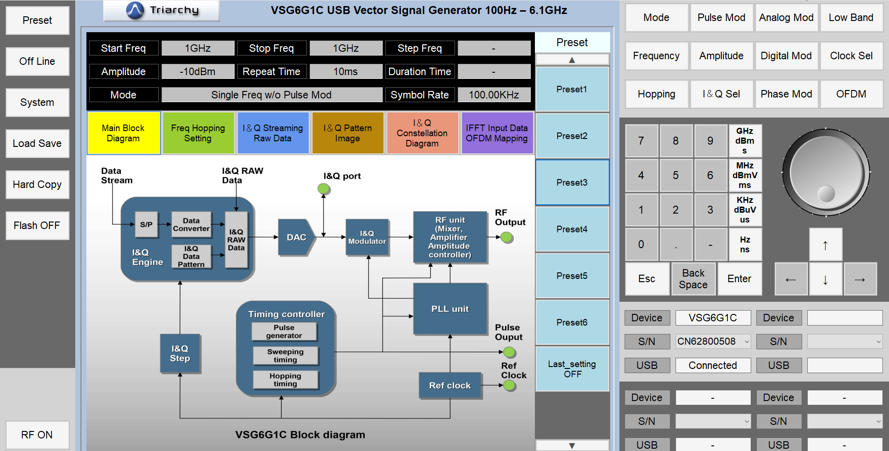

# Приём и демодуляция сигнала от VSG6G1C с помощью связки ADALM Pluto и GNU Radio
В данной работе были использованы:
- Векторный генератор сигнала [Triarchy Tech VSG6G1C](https://www.triarchytech.com/Downloads/VSG2G5C/VSG6G1C%20VSG2G5C%20Operating_manual.pdf) 
- [ADALM Pluto SDR](https://wiki.analog.com/university/tools/pluto) ревизии C
- [GNU Radio](https://www.gnuradio.org/) в сборке [Radioconda](https://github.com/ryanvolz/radioconda). В этой сборке уже включены блоки для ADALM Pluto и некоторых других SDR трансиверов. 

## Настройка генератора
**При установке управляющей программы, имя пользователя ОБЯЗАТЕЛЬНО должно быть написано латиницей, иначе программа будет выбрасывать ошибку. Создание новго пользователя с именем латиницей НЕ ПОМОГАЕТ. Проще всего - установить чистую систему на виртуальную машину**

1. Открываем программу VSG (vector signal generator). 

На рисунке ниже приведёи интерфейс программы VSG, который явно ориентирован на использование с сенсорными экранами

2. Так как сигнал будет генерироваться с помощью встроенного ЦАП, то в меню I&Q sel установим параметр Internal (т.е. внутренний генератор).

3. Выбирем вкладку "Frequency" и задим несущую частоту. Так как для приёма используется Pluto, то частоту нужно выбрать в соответствии с его диапазоном частот: 325 МГц - 3,8 ГГц.

4. Установим для примера частоту несущей 1 ГГц. 

5. Выберем вкладку Phase Mod, внутри которой выберем Demo QPSK и дождёмся загрузки данных в память прибора. 

  

6. Установим значение I/Q Step Count равным 720, таким образом, частота следования символов будет равна 100 кГц.

Вероятно, внутри используется lookup table, из частота выборки значений из которой регулируется этим параметром.

7. Подключим выход генератора ко входу  Pluto и нажмём кнопку включения РЧ выхода в левом нижнем углу программы.

##  Разбор графа в GNU Radio
1. Установим переменную sample rate равной 5 МГц.

2. Поставим блок, отвкчающий за выдачу данный с АЦП Pluto. 

Для этого блока добавим две переменные: усиление и частоту внутреннего генератора. Усиление будет варьироваться в пределах от 1 до 72 дБ. Оно влияет на искажение принятого сигнала. Частоту генератора можно варьировать, чтобы посмотреть, при каком расхождении по частоте петля захвата частоты перестанет работать. 

  

3. Установим [блок](https://wiki.gnuradio.org/index.php/FLL_Band-Edge) петлли захвата частоты. На выходе должен быть сигнал, на несущей частоте (даже если входной сигнал был смещён)

  

Количество отсчётов на символ для этого устройства всегда равняется 10. 

В данном блоке используется полосовой фильтр, поэтому необходимо задать его размер таким образом, чтобы обеспечивалось усреднение по количеству символов. В данном случае, фильтр будет больше в два раз. 

Параметр Filter roloff factor должен устанавливаться в соответствии с параметром excess BW у модулятора. Поскольку, параметр неизвестен, то установи 0.5. 

Последний параметр является коэффициентом того, насколько сигнал ошибки будет "сглаживаться" после каждого отсчёта. Он равен двум пи, делить на число отсчётов на символ и делить на 100. При уменьшении этого параметра, уменьшается время отклика петли.

4. Установим блок символьной синхронизации. На выходе должны быть символы модулированного сигнала.

  

Параметр Expected TED Gain оставим по-умолчанию.

При уменьшении этого параметра, уменьшаяется скорость реакции на блока. Оставим по-умолчаинию. Отвечает за сглаживание сигналов ошибки.

Параметр Damping Factor отвечает за отслеживание символьной частоты. Оставим значение по умолчанию. 

Параметр Maximum Deviation описывает максимальное абсолютное отклонение оценки среднего тактового периода от заданного пользователем номинального тактового периода в единицах выборок на символ. Чем он меньше - тем лучше для захвата в начале передачи пакета. Так как, у нас нет блока задержки, то синхронизироваться нужно как сразу, следовательно, уменьшим это значение до 0,1, вместо 0,5 по умолчанию. 

Параметр output samples per symbol отвечает за количество выходных отсчётов на символ. Установим его равным единице, так как больше нам не требуется выполнять синхронизацию и не требуется избыточных данных. 

Далее, выберем фильтр, оценивающий минимальную среднеквадратичную ошибку.

5. Установим блок декодирования созвездия. На одном выходе будут единицы и нули, на другом числа от 0 до порядка модуляции минус 1.

  

В данный блок нужно передать название блока созвездия. Так как созвездие типовое, то значения оставим по умолчанию.

6. Добавим блоки для наблюдения за сигналом.

## Результаты работы

Как можно увидеть, по глазковой диаграмме, фронты не пересекаются, чётко прослеживается раскрыв глаза. По созвездию видно наличие амплитудной и фазовой ошибки, но при этом, все символы определяются корректно. 

  

Также можно посмотреть на декодированные символы.

  

## Эксперименты

Попробуем посмотреть на работу петли захвата частоты. Для этого, изменим частоту встроенного генератора, увеличим её на 214 кГц.

  

Как мы видим, синий спектр (принятый сигнал) смещён на частоту разницы несущей и внутреннего генератора, в то время как красный спектр находится на несущей частоте. Созвездие при этом не изменилось, следовательно, система захвата частоты работает правильно. 

Далее, попробуем увеличить усиление.

  

Как видим, в этом случае система перегружается и созвездие искажается, следовательно, при ещё большем увеличении усиления, будут возникать ошибки демодуляции.